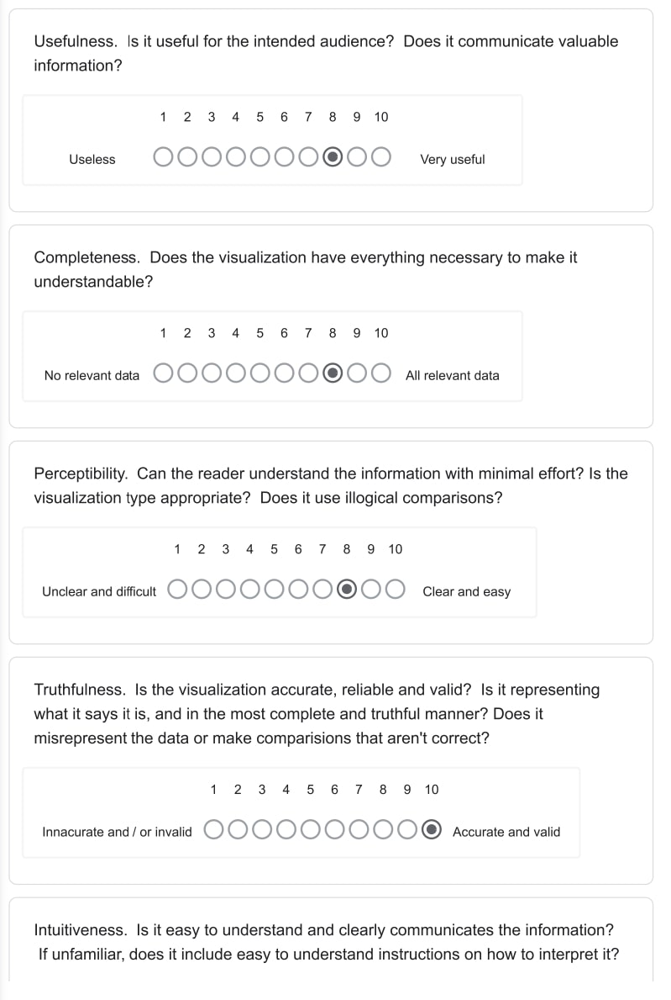
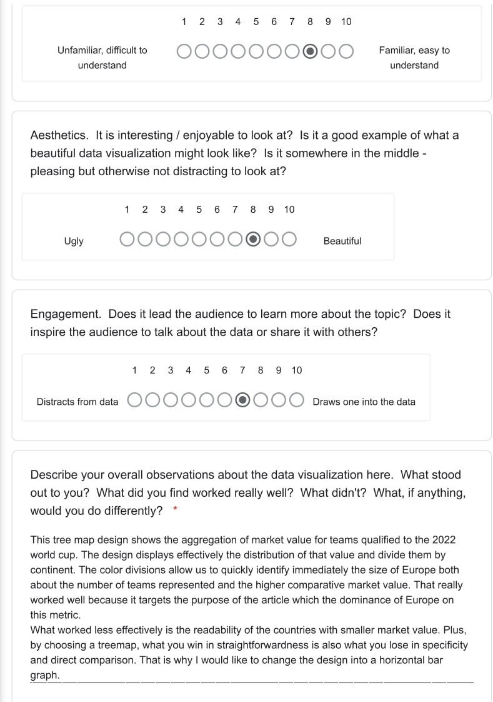
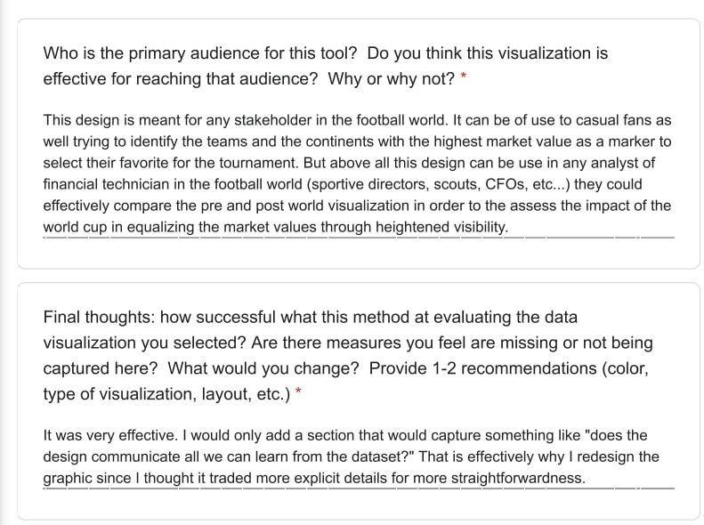

# Critique by Design

## Step one: Find a data visualization
This design (<a href="https://www.statista.com/topics/9211/2022-fifa-world-cup/#topicOverview">Market value of qualified teams (millions euros)</a>) was made by Statista as part of their world cup data series. It showcases a treemap displaying the european dominance in terms of countries with the highest team market value for the upcoming world cup. 

## Step two: Critique the data visualization

## Step three: Sketch out a solution

I started with an initial sketch to clarify my ideas.

  
Then, I made up a second rough digital design to capture the general idea with more readability and color schemes to identify the continents. As you can see, this step enabled me to represent the distinctions in number of countries qualified and their market values per continent. At this stage, we can already make some early comparisons and are able to re-tell the story in a more detailed manner. 

## Step four: Test your solution
  ### Critique 1: from my dad
1. I think this a graphical representation of the market value of the national teams participating in the 2022 World Cup.
2. The first message I get from this graph is the fact that most of the highest valued teams are in Europe.
3. The first things I notice in the graph are the continent names. They are more emphasized than the countries.
4. World Cup viewers in general but given the focus on continents, I think that a more specific audience for this can be various football stakeholders and parties interested in the development of the sport at the continental level.
5. No, I think it achieves the intended goal. 
  
  ### Critique 2: from a peer
1. The visualization ranks the market value of “World Cup Teams” with color coding and labels for continent of country of origin. 
2. This tells me that most of the top teams are from Europe and South America, and the top two are England and Brazil. African and Asian Teams tend to be ranked lower.
3. The labels on the bars is a little confusing. I might rather have a legend. 
4. I assume the intended  audience would understand which world cup is being referenced, and would likely be European, since the monetary scale is in Euros.
5. I might remove the continent labels since they are somewhat repetitive. To give a more global perspective, I might group the bars by continent and sort them by value within the group.

What I gathered from these critique is that the audience was able to directly identify the story being told by the design. I also was took in their feedback to improve on an already good re-design in order to add a layer of detail.

## Step five: Build your solution

<noscript></noscript><object class='tableauViz'  style='display:none;'>
  <param name='host_url' value='https%3A%2F%2Fpublic.tableau.com%2F' /> 
  <param name='embed_code_version' value='3' /> <param name='site_root' value='' />
  <param name='name' value='WorldCupTeamsValueRe-design&#47;Sheet12' /><param name='tabs' value='no' />
  <param name='toolbar' value='yes' />
  <param name='static_image' value='https:&#47;&#47;public.tableau.com&#47;static&#47;images&#47;Wo&#47;WorldCupTeamsValueRe-design&#47;Sheet12&#47;1.png' />
  <param name='animate_transition' value='yes' />
  <param name='display_static_image' value='yes' />
  <param name='display_spinner' value='yes' />
  <param name='display_overlay' value='yes' />
  <param name='display_count' value='yes' />
  <param name='language' value='en-US' />
  <param name='filter' value='publish=yes' />
  </object>
  
                
  
   
The purpose behind this re-design was to make fully evident the information in the dataset such that the audience would immediately capture the information displayed. 
	For starters, I changed the design from a treemap to a bar graph dividing the countries by their respective continents (color-coded). My objective was to demonstrate that the treemap lacked some additional explanatory features even though it probably achieved the original author's goals which was to highlight the European dominance. With the same data set, the bar graph is able to show the magnitude of such dominance with exact numbers. Besides, it gives the audience more identifying features.
	Then, after a couple rounds of feedback, I made some edits to the digital sketch to capture the essence of the re-design. (1) I changed the layout to a vertical shift in order to allow the audience to effectively compare the team's market value accross countries, accross continents, and within continents. (2) The color cordination is now immediately described by the legend and the filter tool as been refined to display teams of a continent at will.
	Overall, this re-design was added a plus-value in terms of instructional potentcy. It gives the audience more information without necessarily overwhelming them. Each feature has been carefully tailored to only value and embellish the design. 
  
I.K.
